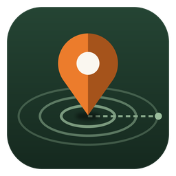

<p align="center"></p>

# OffGridFinder

Offline proximity search over OpenStreetMap data, with a desktop GUI.

Download a state or country once while you have a connection. After that you can run queries like these with no data at all:

- Dollar General within 5 mi of `34.5773, -83.3324`
- Every gas station in the region, sorted by distance from my campsite
- Campgrounds within 2 mi of any part of the Appalachian Trail
- Drinking water between 0.5 and 3 mi from a saved place called "Camp 2"
- Grocery stores within 10 mi of any town, then hardware stores within 1 mi of those results

When you are back online, one button checks for newer data and rebuilds the regions that changed.

## How it works

Map data comes from [OpenStreetMap](https://www.openstreetmap.org), downloaded as regional `.osm.pbf` extracts from [Geofabrik](https://download.geofabrik.de). Geofabrik rebuilds most extracts daily and covers every continent, country and US state, plus sub-regions for many countries.

On import, OffGridFinder reads the extract with [pyosmium](https://osmcode.org/pyosmium/) and keeps the things people search for: shops, restaurants, fuel, lodging, campgrounds, trails, trailheads, parks and protected areas, water sources, peaks, waterfalls, towns, medical, and so on. Roads, buildings without names, and untagged geometry are skipped. Each region becomes one SQLite file with three indexes:

- an R*Tree spatial index, so "within Y of Z" only looks at nearby features
- an FTS5 full-text index over names, brands, operators and categories
- a key/value tag table, so any OSM tag can be used as a filter

Trails, rivers, parks and forests are stored with their shape, so distances to them are measured to the nearest point on the line or edge, and a point inside a park counts as 0 distance. Hiking route relations (for example a long-distance trail made of hundreds of separate paths) are assembled into one feature.

## Download

Prebuilt executables are on the [Releases page](https://github.com/NullAngst/OffGridFinder/releases). No Python install is needed for these.

| Platform | File | Notes |
|---|---|---|
| Linux x86_64 | `OffGridFinder-<version>-linux-x86_64.tar.gz` | Needs glibc 2.35 or newer (check with `ldd --version`) |
| Windows 10/11 x64 | `OffGridFinder-<version>-windows-x86_64.exe` | Single file, run it directly |
| macOS (Apple Silicon) | `OffGridFinder-<version>-macos-arm64.zip` | Contains `OffGridFinder.app` |

`SHA256SUMS.txt` on each release lists checksums for verifying downloads (`sha256sum -c SHA256SUMS.txt --ignore-missing`).

### Linux

```bash
tar xzf OffGridFinder-*-linux-x86_64.tar.gz
cd OffGridFinder-*-linux-x86_64
./install.sh            # copies to ~/.local/bin and adds a menu entry with the icon
```

Or skip the installer and run `./OffGridFinder` from the extracted folder. `./install.sh --uninstall` removes the program and leaves your downloaded regions alone.

The executable is a single self-extracting file, so startup takes a second or two while it unpacks to a temp folder.

### Windows

The executable is not code-signed, so SmartScreen will show "Windows protected your PC" on first launch. Click **More info**, then **Run anyway**. Some antivirus products flag unsigned PyInstaller executables by heuristics. If that is a concern, run from source instead (below); the result is identical.

### macOS

The app is not signed or notarized with an Apple Developer ID, so Gatekeeper blocks it the first time. After unzipping, either right-click the app and choose **Open**, or clear the quarantine flag:

```bash
xattr -dr com.apple.quarantine OffGridFinder.app
```

Intel Macs are not covered by the prebuilt build; run from source on those.

## Run from source

Requirements:

- Python 3.8 or newer
- Tkinter
- `osmium` (pyosmium) 4.0 or newer, only needed for importing. Searching already-imported data works without it.

Tkinter by platform:

| Platform | Command |
|---|---|
| openSUSE Leap | `sudo zypper install python3-tk` |
| openSUSE Tumbleweed | `sudo zypper install python3XX-tk` (match your Python, e.g. `python313-tk`) |
| Debian / Ubuntu | `sudo apt install python3-tk` |
| Fedora | `sudo dnf install python3-tkinter` |
| Arch | `sudo pacman -S tk` |
| Windows / macOS | Included with the python.org installer |

```bash
git clone https://github.com/NullAngst/OffGridFinder.git
cd OffGridFinder
python3 -m venv .venv
source .venv/bin/activate        # Windows: .venv\Scripts\activate
pip install -r requirements.txt
python3 offgrid_finder.py
```

pyosmium ships binary wheels for Linux, macOS and Windows on current Python versions, so `pip` normally installs it without a compiler.

## First run: get a region

1. Open the **Regions** tab.
2. Click **Refresh list (online)**. The region list is cached, so you only need to do this again when you want Geofabrik's latest list.
3. Type in the filter box (for example `georgia`), select one or more regions, and click **Download and import selected**.
4. Watch the log at the bottom. When it says `Import complete`, the region is usable offline.

Two options sit under the list:

- **Include street addresses** indexes every `addr:housenumber` in the extract, so you can search "123 Main St" and use it as a starting point. This makes the database much larger and the import slower.
- **Keep downloaded .osm.pbf** keeps the raw extract on disk so you can re-import later (after changing the indexing rules, for example) without a connection. Off by default to save space.

You can also import a file you got elsewhere (a custom extract from [BBBike](https://extract.bbbike.org), a file from a USB stick) with **Import local file...**. Accepted formats: `.osm.pbf`, `.osm`, `.osm.bz2`, `.osm.gz`.

## Searching

The Search tab has three parts.

### 1. What to find

Any combination of the three fields. All filled fields must match.

- **Name or keyword** searches names, brands, operators, refs, cuisine and category words. Prefix matching is on, so `dollar gen` works. Some plain-English words are mapped to OSM categories: `gas` finds fuel stations, `campground` finds camp sites, `restroom` finds toilets. Put `OR` between words to match either (`walmart OR target`).
- **Category** is a list of presets (Gas station, Campground / RV park, Trail (named), Drinking water, Hospital / clinic / urgent care, and about thirty more).
- **Tag filter** accepts raw OSM tags, separated by `;`:

| Syntax | Meaning |
|---|---|
| `brand=Dollar General` | tag equals value (case-insensitive) |
| `cuisine=pizza\|mexican` | tag equals any of the values |
| `opening_hours=*` or `opening_hours` | tag is present |
| `fee!=yes` | tag is missing or has a different value |
| `!fee` | tag is missing |
| `name~lake` | tag value contains the text |

Example: category **Campground / RV park** with tag filter `fee=no; drinking_water=yes`.

The [OSM wiki Map Features page](https://wiki.openstreetmap.org/wiki/Map_features) lists the tags in use. Selecting any search result shows all of its tags, which is the quickest way to see what is available for filtering.

### 2. Distance

- **At least / at most**, in mi, km, m or ft.
- Leave **at most** empty to list every match in every installed region, nearest first. This is the "list all Dollar Generals by distance from my campsite" mode.
- **At least** is useful for "somewhere to resupply that is not right next to camp".

### 3. Measured from

- **Coordinates**: decimal (`34.5773, -83.3324`), degrees/minutes/seconds (`34°34'38"N 83°19'57"W`), or a pasted map URL containing `@lat,lon`.
- **Saved place**: named points you manage on the Saved places tab (campsites, a trailhead, home).
- **Chosen feature(s)**: click **Pick features...**, search for anything in the data (a trail, a park, a town, a store), then either select specific rows or click **Use ALL matches**. With several anchors, each result is measured to whichever anchor is closest, and the result shows which one that was.

### Chaining searches

After any search, **Use all results as anchor** makes those results the starting point for the next search. Change "What to find" and search again. Example:

1. Find category **Town / city / village** within 40 mi of your coordinates.
2. Use all results as anchor.
3. Find **Pharmacy** within 1 mi.

The result is every pharmacy within a mile of any town in that 40 mile circle, each tagged with the town it is closest to.

### Results

- Click column headers to sort.
- Selecting a result shows its tags, coordinates, and for trails and parks the closest point on the shape (useful as an access point).
- **Export CSV** or **Export GPX**. GPX waypoints load into most GPS units and phone apps.
- **Save as place**, **Use as anchor**, **Copy coordinates**, and **Open on openstreetmap.org** (needs a connection).

### Plot tab

A schematic view of the last search: anchors in orange (with the radius circle for single points), results as numbered blue dots, and the selected result with a dashed line from where it was measured. Optional context lines show nearby trails, water and park edges from your offline data. Drag to pan, scroll to zoom, click a dot to select it.

This is a sketch for orientation, not a street map. See Limitations.

## Updating

On the Regions tab, while online:

- **Check for updates** compares each region's stored `Last-Modified` time with Geofabrik's server.
- **Update all outdated** downloads and re-imports only the regions with newer data.
- **Update selected** re-imports the selected regions regardless.

An update builds a new database next to the old one and swaps it in when finished. If the download fails or you cancel, the old data stays as it was.

Updates are full re-downloads of the extract. OSM change files (diffs) are not applied.

## Command line

```bash
OffGridFinder --data-dir /path/to/data           # use a different data folder
OffGridFinder --import-file region.osm.pbf --name "My Region" [--addresses]
OffGridFinder --self-test [--log FILE]            # built-in checks, exit code 0 on success
OffGridFinder --version
```

(From source, replace `OffGridFinder` with `python3 offgrid_finder.py`.)

The headless import is handy for building region files on a desktop and copying them to a laptop. Region files are ordinary SQLite databases in `regions/` and can be copied between machines and between platforms.

`--self-test` imports a small embedded dataset and runs a set of searches against it. CI runs it against every executable before publishing, and it is a quick way to confirm a build works on your machine.

## Where data lives

| OS | Default folder |
|---|---|
| Linux | `$XDG_DATA_HOME/OffGridFinder` or `~/.local/share/OffGridFinder` |
| macOS | `~/Library/Application Support/OffGridFinder` |
| Windows | `%APPDATA%\OffGridFinder` |

Override with `--data-dir` or the `OFFGRIDFINDER_HOME` environment variable. Inside:

```
regions/                  one .db per installed region
downloads/                .osm.pbf files (only kept if you ask)
app.db                    saved places and settings
geofabrik-index.json      cached list of downloadable regions
```

## Sizes and resources

- Download size depends entirely on the region. A US state is usually tens to a few hundred MB, large countries are several GB, and continents are tens of GB. The installer asks for confirmation before continent-level downloads.
- The region database is usually much smaller than the `.pbf`, because most OSM data is roads and buildings that are not indexed. Turning on addresses changes that.
- Import holds node locations in memory. A state or small country is comfortable on a normal laptop. Very large extracts need a lot of RAM and time; importing several state extracts is lighter than one country extract.

## Limitations

Read these before relying on the tool somewhere remote.

- **Distances are straight-line.** "Within 5 mi" means 5 miles as the crow flies. There is no road network and no routing, so a store 3 mi away across a river gorge might be a 25 mi drive. Use it to find candidates, then check the route with a navigation app (Organic Maps and OsmAnd both work offline and pair well with this).
- **OpenStreetMap coverage varies.** Chain stores, fuel and towns are generally well mapped in the US and Europe. Small independent businesses, rural areas, and recently opened or closed places may be missing or out of date. A search that returns nothing means nothing is in the data, not that nothing exists.
- **Opening hours are shown, not evaluated.** There is no "open now" filter. `opening_hours=*` can filter to places that at least list hours.
- **Unnamed trails are not indexed** unless they belong to a named route relation. Adding every unnamed footway would add a lot of noise and size.
- **Shapes are simplified** above 4,000 vertices per feature. Distances to very large forests or long trails can be off by a small amount near the simplified edges.
- **Shape-to-shape distances are approximate.** When both the anchor and the result are lines or areas (for example "rivers within 1 mi of a trail"), distance is estimated by sampling vertices, so it can slightly overestimate.
- **Wide multi-anchor searches with no maximum distance are the slowest case.** Thousands of anchors against thousands of candidates can take a while. Adding a maximum distance makes it fast. **Stop** cancels any search.
- **The antimeridian (180° longitude) is not handled.** This only matters for parts of Alaska, Fiji, Russia and New Zealand's outer islands.
- **Overlapping regions are de-duplicated** by OSM id, so installing both a state and its neighbor will not double-list features on the border.
- The Plot tab has no basemap imagery.

## Customizing what gets indexed

Everything that controls indexing is at the top of `offgrid_finder.py`:

- `PRIMARY_KEYS` sets which OSM keys make something a feature, and in what priority order they choose its category.
- `AMENITY_NOISE`, `TOURISM_NOISE`, `LEISURE_UNNAMED_OK`, `NATURAL_UNNAMED_OK` and friends decide what is dropped when it has no name.
- `PRESETS` defines the Category dropdown. Each preset is a list of `(key, [values])` pairs, or `(key, None)` for "any value".
- `SYNONYMS` adds extra search words per category.

After changing indexing rules, re-import (use **Keep downloaded .osm.pbf** if you expect to do this often).

## Building executables

The workflow in `.github/workflows/release.yml` builds all three platforms with [PyInstaller](https://pyinstaller.org), runs `--self-test` on each built executable, and attaches them to a GitHub Release.

To publish a release:

1. Set `APP_VERSION` near the top of `offgrid_finder.py` (for example `1.1.0`).
2. Commit, then tag with the same version prefixed by `v` and push the tag:
   ```bash
   git tag v1.1.0
   git push origin v1.1.0
   ```
3. The workflow refuses to build if the tag and `APP_VERSION` disagree. When it finishes, the release appears with the three executables, `SHA256SUMS.txt`, and notes generated from the commits since the last tag.

To test a build without releasing, open the Actions tab, pick **Build and release**, and click **Run workflow**. The executables show up under that run's Artifacts.

`.github/workflows/ci.yml` runs lint plus the self-test from source on all three platforms for every push and pull request.

To build locally for your own platform:

```bash
pip install -r requirements.txt -r requirements-build.txt
pyinstaller --noconfirm --clean offgridfinder.spec
./dist/OffGridFinder --self-test                  # Windows: dist\OffGridFinder.exe, macOS: dist/OffGridFinder.app
```

PyInstaller does not cross-compile, so each platform's executable has to be built on that platform. That is why the workflow uses three runners.

### Icon

`tools/make_icon.py` draws the icon with Pillow and writes `assets/icon.png` (1024 px master), `assets/icon-256.png` (window icon), `assets/icon.ico` and `assets/icon.icns`. The generated files are committed, so builds do not need to run it. After editing the script:

```bash
pip install pillow
python3 tools/make_icon.py
```

## Repository layout

```
offgrid_finder.py              the application (single file)
offgridfinder.spec             PyInstaller build definition
requirements.txt               runtime dependency (pyosmium)
requirements-build.txt         build-only dependencies (PyInstaller, Pillow)
assets/                        icons, generated by tools/make_icon.py
tools/make_icon.py             icon generator
packaging/linux/               .desktop entry and per-user install script
.github/workflows/ci.yml       lint and self-test on push / PR
.github/workflows/release.yml  build, test and release executables on tag
```

## Data license and attribution

Map data is © OpenStreetMap contributors and available under the [Open Database License (ODbL)](https://www.openstreetmap.org/copyright). If you publish or share results (a CSV, a GPX file, a screenshot), the ODbL requires crediting OpenStreetMap. Extracts are provided by [Geofabrik GmbH](https://download.geofabrik.de); please do not script bulk downloads against their server beyond normal update checks.

## License

OffGridFinder is free software, released under the [GNU General Public License v3.0](https://www.gnu.org/licenses/gpl-3.0.html) or later. See `LICENSE`.
